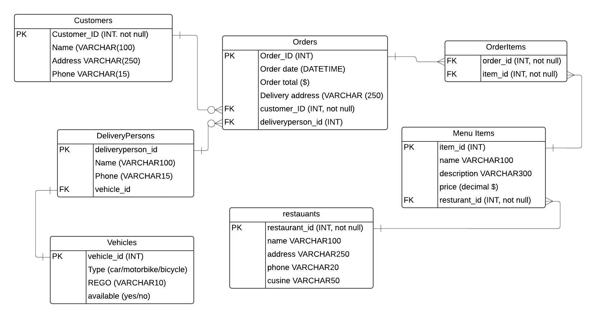

My api is a food delivery API along the lines of Uber Eats or Deliveroo.

trello: https://trello.com/invite/b/67656701078496e36a6dcdbd/ATTI9d5009ae9f1ba48cfa7a30fdbf8245d0A738156C/fooddeliveryapi

github repo: https://github.com/bronny86/deliveryapi

render: https://bronny-delivery-api.onrender.com

First conversations with Simon:

ERD:

TRELLO:

CRUD OPERATIONS (and error handling) FOR CUSTOMER ENTITY:

      

CRUD OPERATIONS (and error handling) FOR ORDERS ENTITY:

    

CRUD OPERATIONS (and error handling) FOR DASHERS ENTITY:

        

CRUD OPERATIONS (and error handling) FOR MENU ITEM ENTITY:

      

CRUD OPERATIONS (and error handling) FOR ORDER ITEMS ENTITY:

        

CRUD OPERATIONS (and error handling) FOR RESTAURANTS ENTITY:

       

Deployment using GUnicorn:

Deployment using Neon:

Deployment using Render:

